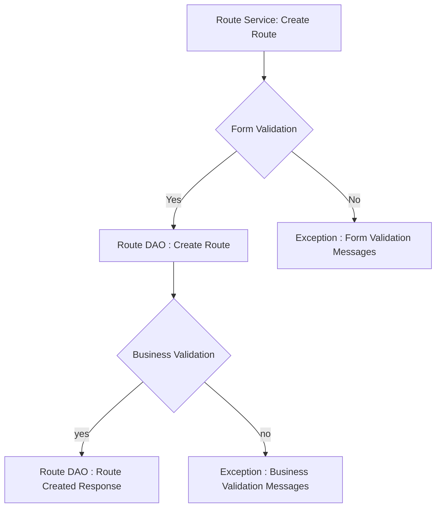
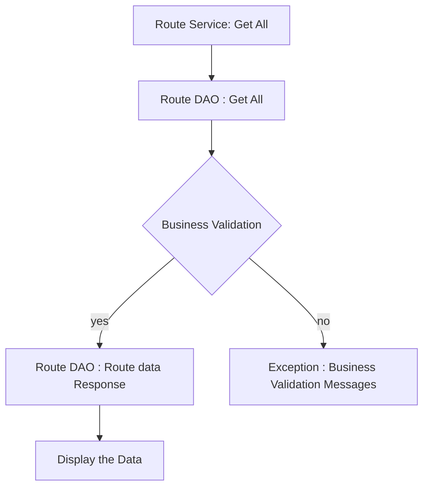

# Bus Ticket Booking 

## Database Design


[]
[]
## Project Setup

- [ ] Create a new Java project
- [ ] Set up a MySQL database
- [ ] Add necessary libraries
  - [ ] JDBC
  - [ ] MySQL Connector
  - [ ] JUnit
  - [ ] Dotenv

## Module: Route Management

### Feature: Create Route
### Feature Usage
New route can be added to the table
#### Pre-requisites:
- [ ] Create Route table
- [ ] Implement Route model
- [ ] Implement Route DAO (create)
- [ ] Implement Route Services (create)
#### Validations:
##### Form validation
- [ ] From Location
- [ ] To Location
- [ ] Base Price
##### Business Validation
- [ ] Check for routes with the same 'from' and 'to' locations in the table.

#### Messages
- [ ] From Location is not valid
- [ ] To Location is not valid
- [ ] Already a route with same from and to locations

#### Flow:


  
### Feature: View all routes
### Feature Usage
Retrieve all active routes.
#### Pre-requisites:
- [ ] Create Route table
- [ ] Implement Route model
- [ ] Implement Route DAO (get All)
- [ ] Implement Route Services (get All)

#### Business Validation:
- [ ] Table Validation

### Messages
- [ ] Table is not exists

#### Flow:



### Feature:View all routes with specific From location
### Feature Usage
Get all active routes with a specific location.
#### Pre-requisites:
- [ ] Create Route table
- [ ] Implement Route model
- [ ] Implement Route DAO (getRoutebyFromLocation)
- [ ] Implement Route Services( getRouteByFromLocation )

#### Validations:
##### Form Validation
- [ ] From Location Validation
##### Business Validation
- [ ] Table Validation

#### Messages
- [ ] Enter valid location
- [ ] Table is not exists

#### Flow:

```mermaid
graph TD;
  A[Route Service: Get Route by From Location] --> B{Input Validation}
  B --yes--> C[Route DAO: Get route by to location]
  B --no--> H[Exception : form validation messages ]
  C -- Yes --> D[Route DAO: Get route by From location]
  D --> E[Route Service: Display the data]
  C -- No --> F["Route DAO: Business validation messages"]
  ```
  

### Feature: View all routes with specific to location
### Feature Usage
Get all active routes with a specific location.
#### Pre-requisites:
- [ ] Create Route table
- [ ] Implement Route model
- [ ] Implement Route DAO (getRoutebyToLocation)
- [ ] Implement Route Services( getRouteByToLocation )

#### Validations:
##### Form Validation
- [ ] To Location Validation
##### Business Validation
- [ ] Table Validation

#### Messages
- [ ] Enter valid location
- [ ] Table is not exists

#### Flow:

```mermaid
graph TD;
  A[Route Service: Get Route by to Location] --> B{Input Validation}
  B --yes--> C[Route DAO: Get route by to location]
  B --no--> H[Exception : form validation messages ]
  C -- Yes --> D[Route DAO: Get route by to location]
  D --> E[Route Service: Display the data]
  C -- No --> F["Route DAO: Business validation messages"]
  ```
### Feature: Delete Route
#### Pre-requisites:
- [ ] Create Route table
- [ ] Implement Route model
- [ ] Implement Route DAO (delete)
- [ ] Implement Route Services( Delete)
#### Validations:
##### Form validation
- [ ] Route Id input validation
##### Business validation
- [ ] Table validation

##### Messages
- [ ] Route Id is not valid
- [ ] Route is not found

#### Flow:

```mermaid
graph TD;
  A[Route Service: Delete Route] --> B{Form Validation}
  B --Yes--> D[Route DAO : Delete]
  B -- No --> X[Exception : form validation messages]
  D --yes--> E[Route Service: Response route deleted]
  D -- No --> F["Route DAO:Route not found"]
```

## Module: Bus Management

### Feature: Create Bus
#### Usage
We can add buses to the table along with route id

#### Pre-requisites:
- [ ] Create Bus table
- [ ] Implement Bus model
- [ ] Implement Bus DAO (update 
- [ ] Implement Bus Services( Update)
#### Validations:
##### Form validations
- [ ] Implement User input validation  (Bus no, departure time, arrival time , route id)
##### Business Validation
- [ ]  Table validation and route id validation
#### Messages
- [ ]  Invalid input 
- [ ] invalid route id

#### Flow:


  ```mermaid
graph TD;
  A[Bus Service: Create Bus] --> B{Input Validation}
  B--yes-->C[Bus DAO : Create Bus]
  B--No-->X[Exception : enter valid inputs]
  C --> D{Route Id Validation}
  D --yes--> E{Table Validation}
  D--No-->Y[Exception : invalid route Id]
  E-- Yes--> F["Bus Service: Bus Created"]
  E--No--> Z[Exception : invalid Table]
  ```
  
### Feature: Update Bus 
#### Usage
update the bus details
#### Pre-requisites:
- [ ] Create Bus table
- [ ] Implement Bus model
- [ ] Implement Bus DAO (update)
- [ ] Implement Bus Services( Update)
#### Validations:
##### Form Validation
- [ ] Bus No
- [ ] Timings
##### Business Validation
- [ ] Table validation
#### Messages
- [ ]  Invalid input 
- [ ] invalid route id

#### Flow:
```mermaid
graph TD;
  A[Bus Service: Update Bus] --> B{Input Validation}
  B--yes-->C[Bus DAO : Update Bus]
  B--No-->X[Exception : enter valid inputs]
  C --> D{Route Id Validation}
  D --yes--> E{Table Validation}
  D--No-->Y[Exception : invalid route Id]
  E-- Yes--> F["Bus Service: Bus Updated"]
  E--No--> Z[Exception : invalid Table]
  ```


### Feature: Delete Bus 
#### Usage
Delete bus from the list
#### Pre-requisites:
- [ ] Create Bus table
- [ ] Implement Bus model
- [ ] Implement Bus DAO (Delete)
- [ ] Implement Bus Services (Delete)

#### Validations:
##### Form Validation
- [ ] Bus Id Validation
##### Business Validation
- [ ] Table Validation

#### Flow:
```mermaid
graph TD;
  A[Bus Service: Delete Bus] --> B{Input Validation}
  B --yes--> H[Bus DAO : Delete Bus]
  B -- No --> C[Exception : invalid Input]
  H --> G{ Business validation}
  G-- Yes --> D[Bus DAO:  Bus deactivated]
  D --> E[Bus Service: Bus Updated Response]
  G -- No --> F[" Table not found"]
  ```
### Feature: Get Bus 
##### usage
Get All bus which are active
#### Pre-requisites:
- [ ] Create Bus table
- [ ] Implement Bus model
- [ ] Implement Bus DAO (getAll)
- [ ] Implement Bus Services (getAll)
#### Validations
##### Business Validation
- [ ] Table validation

#### Messages
- [ ] Table not found
- [ ] no data

#### Flow:
```mermaid
graph TD;
  A[Bus Service: Get Bus] --> H[Bus DAO : Get Bus]
  H --> G{ Business validation}
  G-- Yes --> D[Bus DAO:  Display the data]
  G -- No --> F[" Table not found"]
  ```

### Feature: Get Bus with Route Id
#### Usage
Get buses assigned to a specific Route ID
#### Pre-requisites:
- [ ] Create Bus table
- [ ] Implement Bus model
- [ ] Implement Bus DAO (get All with route id)

#### Validations
##### Form Validation
- [ ] input validation
##### Business Validation
- [ ] Table validation

#### Messages
- [ ] Table not found
- [ ] no data
- [ ] Invalid Route Id

#### Flow:
```mermaid
graph TD;
  A[Bus Service: Get Bus with route Id] --> G{Input Validation}
  G-- yes --> B[Bus DAO: Get Bus with route Id]
  G -- No --> O[Invalid Route ID]
  B --> C{Business Validation}
  C -- Yes --> D[Bus DAO:  get All with route id]
  C -- No --> F["Table not found"]
  ```

